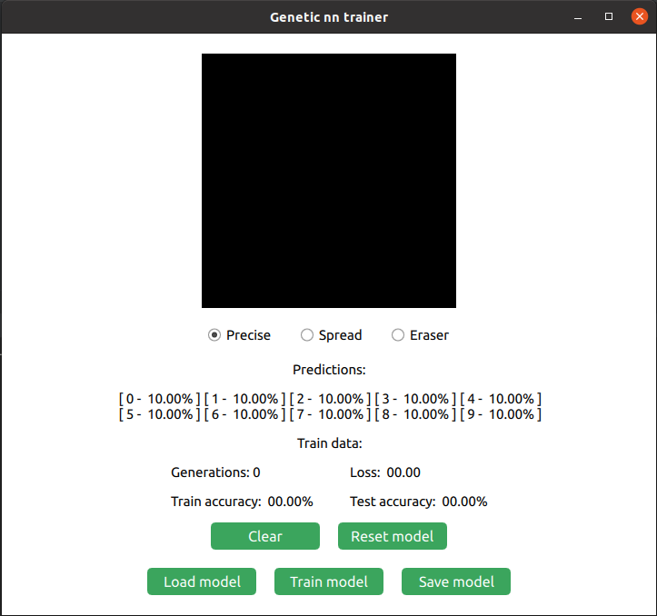
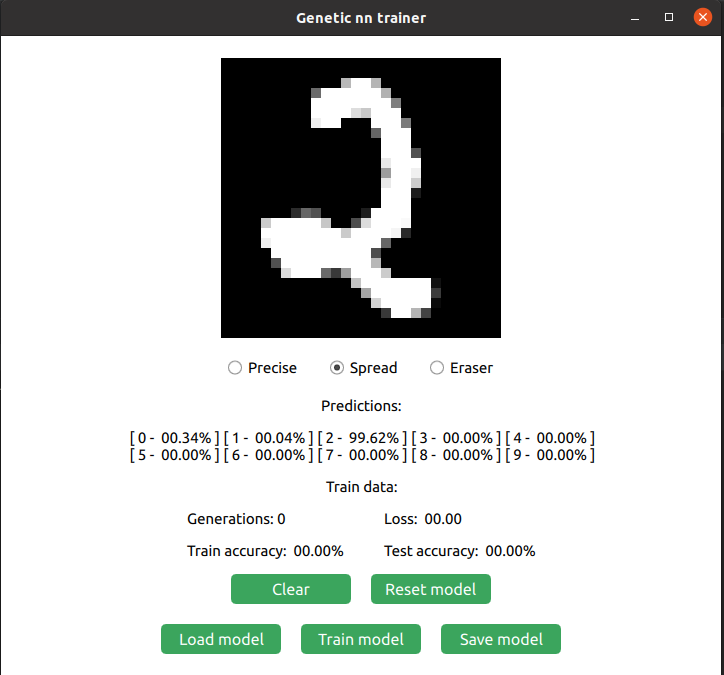
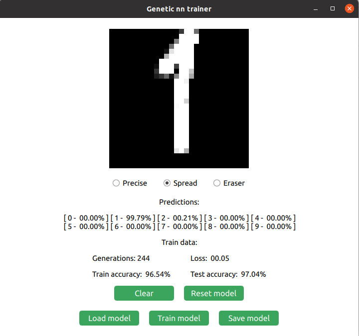

# Genetic Neural Network Trainer

This project shows an example of training a Multilayer Perceptron network with genetic algorithms.

The project's directory structure:
* `data/` - various data used for testing
  * `data/mnist/` - dataset for handwritten digit recognition
  * `data/models/` - models saved after training
* `gnnt/` - main directory with the implementation
  * `gnnt/gnnt/mlp/` - compile-time Multilayer Perceptron network
  * `gnnt/gnnt/training/` - genetic algorithm implementation
* `ui/` - user interface implemented using QT
* `test/` - test cases for activation functions with the `Catch2` framework

## Screenshots
    
### The Graphical User Interface

### Example prediction for manually drawn digit

### Example of training a network
